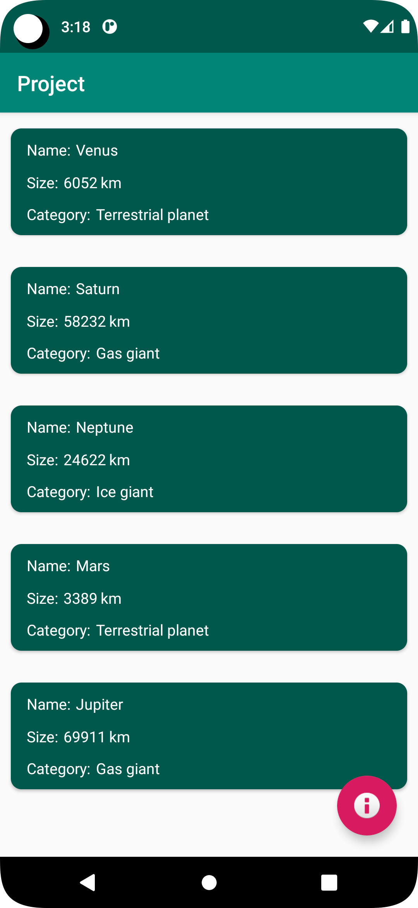
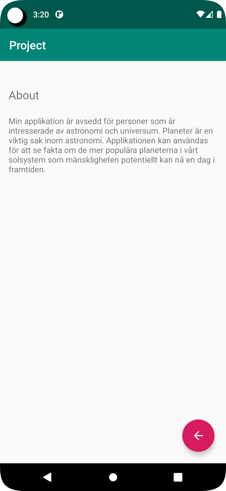

# Rapport

För projektet skapade jag en applikation som visar upp information om Planeter i vårt solsystem. Jag skapade en Planet klass som hämtar JSON data.
Därefter läggs en RecyclerView till i layouten, samt skapas Adapter och ViewHolder för RecyclerView.
Senare designade jag en CardView med TextViews där den hämtade JSON datan skrivs. Tillslut skapades en About sida som öppnas via en fab knapp från MainActivity

Hämtar JSON data
```
    public String getName() {
        return name;
    }
    public String getSize() {
        return size;
    }

    public String getCategory() {
        return category;
    }
```

ViewHolder visar var datan ska i RecyclerView
```
class ViewHolder extends RecyclerView.ViewHolder {
    public TextView name;
    public TextView size;
    public TextView category;

    public ViewHolder(@NonNull View itemView) {
        super(itemView);
        name = itemView.findViewById(R.id.text_name);
        size = itemView.findViewById(R.id.text_size);
        category = itemView.findViewById(R.id.text_category);
    }
}
```

Fab knapp som öppnar about sidan från MainActivity
```
FloatingActionButton fab = findViewById(R.id.floatingActionButton);
fab.setOnClickListener(new View.OnClickListener() {
    @Override
    public void onClick(View view) {
        startActivity(new Intent(MainActivity.this, about.class));
    }
});
```


